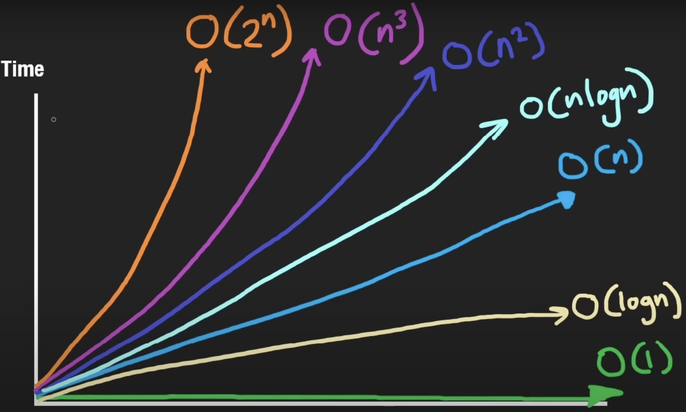

# LeetCode - 75 questions study plan

## Concepts Overview

### Algorithm
A set of steps or instructions for completing a task.
- Clearly defined problem statement with input and output;
- The steps in the algorithm need to be in a very specific order;
- The steps also need to be distinct;
- The algorithm should produce a result;
- The algorithm should finish in a finite amount of time.

### Algorithmic Thinking
Breakes down a problem into steps identiyfing what data structure is best for the task.

### Time Complexity
Way of showing how the runtime of a function increases as the size of input increases.

## References
- [Youtube - Algorithms and Data Structures Tutorial](https://www.youtube.com/watch?v=8hly31xKli0)
- [Youtube - Big-O Notation - For Coding Interviews](https://www.youtube.com/watch?v=BgLTDT03QtU)